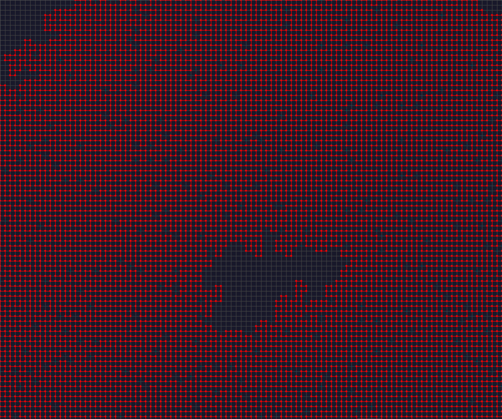
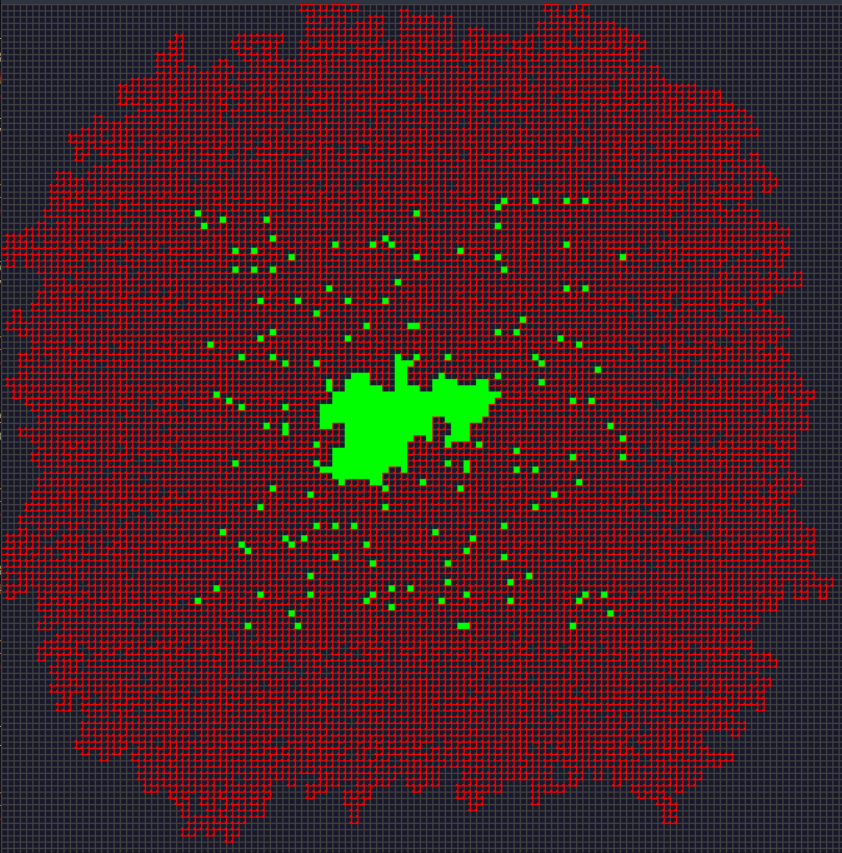

# Day 10

Made a readme for this one because i want to share my render and some resources

</img>
</img>

## And in green are the contained points

## Some googling led me here
- https://matplotlib.org/stable/api/path_api.html

This library helped a lot mostly [this](https://matplotlib.org/stable/api/path_api.html#matplotlib.path.Path.contains_point)
